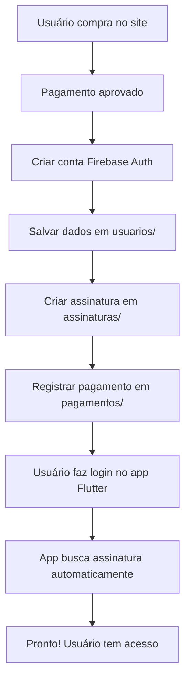

# Guia Rápido: Instalação e Teste da Integração Firebase

## 🚀 Passo a Passo

### 1. Instalar Dependência do Firebase no Site

```powershell
cd D:\github\escrita360_sitereact
pnpm install firebase
```

### 2. Testar Criação de Conta

Acesse a página de pagamento e complete o processo. Os logs no console mostrarão:

```
🔐 Criando conta Firebase para: usuario@email.com
✅ Conta Firebase criada - UID: abc123xyz...
✅ Dados do usuário salvos no Firestore
📝 Criando assinatura no Firestore para: abc123xyz...
✅ Assinatura criada: def456uvw...
🎉 Processo completo! Usuário pode fazer login no app Flutter com as mesmas credenciais.
```

### 3. Testar Login no App Flutter

Abra o app Flutter e faça login com o mesmo email/senha:

```dart
// O app Flutter já está preparado!
// Apenas faça login normalmente
```

O `AssinaturaService` automaticamente:
1. Busca assinatura por `userId`
2. Se não encontrar, busca por `email` (fallback)
3. Corrige `userId` se necessário

## 🔍 Verificar no Firebase Console

1. Acesse: https://console.firebase.google.com/project/escrita360aluno
2. **Authentication** → Ver novo usuário
3. **Firestore Database** → Verificar coleções:
   - `usuarios` → Dados do usuário
   - `assinaturas` → Assinatura ativa
   - `pagamentos` → Histórico de pagamento

## 📋 Checklist de Integração

- [x] Serviço Firebase criado (`src/services/firebase.js`)
- [x] Integração no fluxo de pagamento
- [x] Estrutura de dados compatível com Flutter
- [x] Criação de conta no Firebase Auth
- [x] Registro de assinatura no Firestore
- [x] Registro de pagamento no Firestore
- [x] Logs de debug implementados
- [x] Documentação completa

## 🎯 O Que Foi Implementado

### Arquivos Criados/Modificados

1. **`src/services/firebase.js`** (NOVO)
   - Configuração do Firebase (mesmo projeto do app)
   - `firebaseAuthService` (registro, login, logout)
   - `firebaseSubscriptionService` (criar/buscar assinaturas)
   - `firebasePaymentService` (registrar pagamentos)

2. **`src/pages/Pagamento.jsx`** (MODIFICADO)
   - Importa serviços Firebase ao invés do backend local
   - Cria conta no Firebase Auth após pagamento aprovado
   - Cria assinatura no Firestore
   - Registra pagamento no Firestore

3. **`docs/INTEGRACAO_FIREBASE_FLUTTER.md`** (NOVO)
   - Documentação completa do fluxo
   - Exemplos de código
   - Guias de teste

## 🔄 Fluxo Resumido



## 🎓 Diferenças Importantes

### ❌ Antes (Backend Local)
```javascript
// Usava backend Node.js local
const userData = await authService.register(email, password, name)
// Dados ficavam no backend local (não sincronizados)
```

### ✅ Agora (Firebase Compartilhado)
```javascript
// Usa Firebase Auth diretamente
const userData = await firebaseAuthService.register(email, password, userData)
// Dados ficam no Firestore (sincronizados com app Flutter)
```

## 🧪 Como Testar

### Teste Completo End-to-End

1. **No Site:**
   ```
   1. Acesse /precos
   2. Escolha plano "Intermediário"
   3. Preencha dados:
      - Email: teste@escrita360.com.br
      - Senha: teste123
      - CPF, cartão, etc.
   4. Conclua pagamento
   5. Veja mensagem de sucesso
   ```

2. **No Console do Navegador:**
   ```
   Verifique os logs:
   ✅ Conta Firebase criada - UID: ...
   ✅ Assinatura criada: ...
   ```

3. **No Firebase Console:**
   ```
   1. Authentication → Ver novo usuário
   2. Firestore → usuarios → Ver documento
   3. Firestore → assinaturas → Ver assinatura
   ```

4. **No App Flutter:**
   ```
   1. Abra o app (Windows/Android/iOS)
   2. Faça login: teste@escrita360.com.br / teste123
   3. Verifique que está logado
   4. Veja tokens disponíveis (10 tokens)
   ```

## 🚨 Troubleshooting

### "Email já está em uso"
```javascript
// Erro esperado se tentar criar conta duplicada
// Solução: Use email diferente ou faça login
```

### "Permissão negada" no Firestore
```javascript
// Configure as regras do Firestore (ver INTEGRACAO_FIREBASE_FLUTTER.md)
```

### App Flutter não encontra assinatura
```dart
// O app tem fallback automático por email
// Se persistir, rode: AssinaturaService.corrigirUserIdsAssinaturas()
```

## 📞 Próximos Passos

1. Instalar Firebase SDK: `pnpm install firebase`
2. Testar fluxo completo
3. Configurar regras do Firestore (se necessário)
4. Monitorar logs para debug

## ✅ Benefícios da Integração

- ✅ **Uma conta, múltiplas plataformas**
- ✅ **Sincronização automática**
- ✅ **Mesmo Firebase Auth do app**
- ✅ **Estrutura de dados compatível**
- ✅ **Tokens compartilhados**
- ✅ **Histórico unificado**

---

**Pronto para usar!** 🎉
